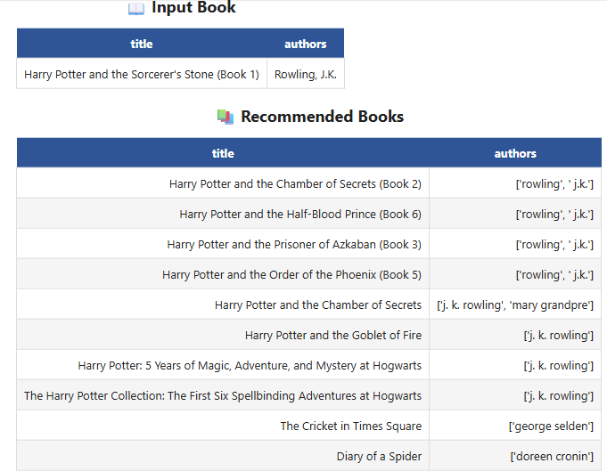
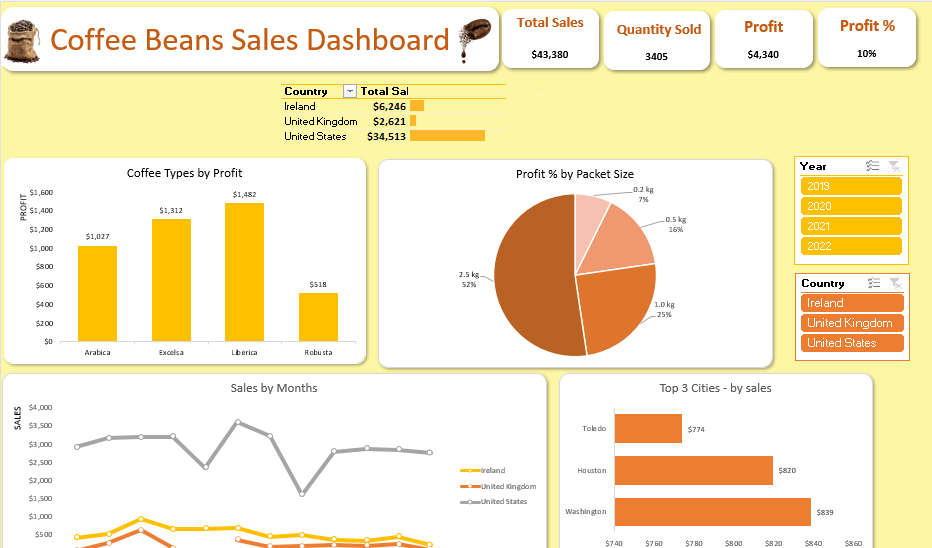
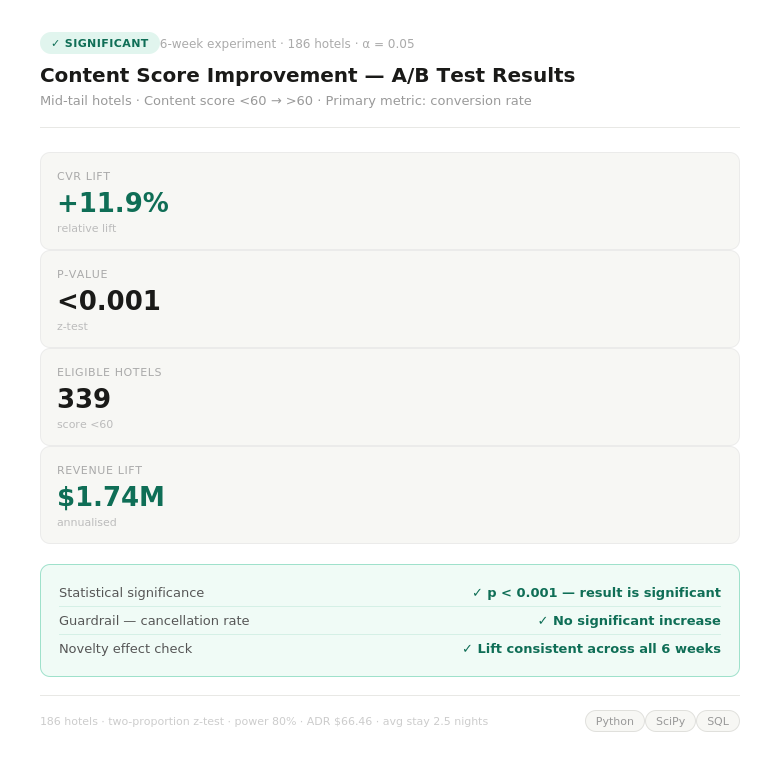

# Portfolio
## This portfolio is a compilation of some of the major data analytics projects I have done during my learning journey.
---
## Projects:

### Project 1: Wearable Device Usage Analysis: Uncovering Health & Activity Patterns

**Overview:** Analyzed Fitbit smart device data to uncover trends in user activity, sleep, and sedentary behavior, and translated findings into actionable product and marketing recommendations for Bellabeat — a health-tech company creating smart wellness products for women.

**Goal:** Identify trends in smart device usage, apply them to Bellabeat's customer base, and shape a data-driven marketing strategy for the Bellabeat Time wellness watch.

**Skills:** EDA, SQL (DDL, DML, CTEs, Window Functions, CASE Statements, Joins), Dashboard Design (LOD Expressions, Calculated Fields, Parameters, Layout Containers, Dynamic Filters, Light/Dark Mode), Data Storytelling

**Tools Used:** MS SQL Server, Tableau, Visual Studio Code, GitHub Copilot

**Results:**
1. Users average **7,500 steps/day** — 25% below WHO's 10,000 step recommendation — with **81% of daily time spent sedentary** (16.4 hrs).
2. Average sleep is **6.3 hrs/night**, creating a 10.5 hr weekly sleep deficit; users lose 42 mins nightly lying awake in bed.
3. Identified **54% of users as lightly active** — the prime Bellabeat target segment — with peak activity occurring in the evening (5–7 PM).
4. Recommended 3 Bellabeat product features: 60-min inactivity alert, bedtime wind-down notification, and weekday habit-building challenges.
5. Proposed marketing strategy: lead with the sleep gap story and schedule campaigns at 5–7 PM to align with peak user motivation.

---
### Project 2: Customer Segmentation Analysis

**Overview:** Analysed a 2,240-customer retail CRM dataset to identify why uniform marketing campaigns were generating low conversions. Used the RFM (Recency, Frequency, Monetary) framework to segment customers by actual purchasing behaviour and mapped 5 named campaigns to the segments that converted best.

**Goal:** To give the marketing team a data-backed answer to: **"Who are our customers really, and what's the smartest way to reach each group?"**

**Skills:** Data cleaning & outlier detection, feature engineering, RFM segmentation, ANOVA statistical validation, campaign conversion rate analysis, Data Visualization.

**Tools Used:** Python (libraries used — Pandas, NumPy, Matplotlib, Seaborn, Plotly, Scikit-learn, SciPy)

**Results:**
1. Identified 6 distinct customer segments with statistically validated spend differences (ANOVA p < 0.05).
2. Found Campaign 2 (New Arrivals Push) underperforming at <1.5% conversion — recommended pausing and reallocating budget.
3. Delivered 6 prioritised actions with estimated revenue impact of **~$170K–$255K**.

---
### Project 3: Electric Vehicle (EV) Market Analysis

**Overview:** A market intelligence study of India's EV landscape (FY 2022–2024) built for AtliQ Motors — a U.S.-based EV company with 25% North American market share but less than 2% in India. The analysis covers competitor mapping, state-level penetration rates, revenue growth, charging infrastructure gaps, and 2030 sales projections to inform their India entry strategy.

**Goal:**
1. Identify the top competitors in the 2-Wheeler and 4-Wheeler EV segments.
2. Determine the best states and month to launch — and which to avoid entirely.
3. Deliver three prioritised, data-backed recommendations for AtliQ Motors' India expansion.

**Skills:** Data collection from government sources, SQL (DDL, DML, CTEs, aggregations), CAGR & penetration rate analysis, geographic segmentation, revenue modelling, Data Visualization, PowerPoint storytelling (Situation–Complication–Resolution framework).

**Tools Used:** MS SQL Server, Tableau, PowerPoint.

**Results:**
1. *Competitor Landscape:* OLA Electric and TVS dominate 2-Wheelers; Tata Motors sells ~3× more than the next 4 competitors combined in 4-Wheelers.
2. *Launch Strategy:* Recommended Goa (24% penetration) for 2-Wheelers and Karnataka for 4-Wheelers — backed by 15% capital subsidy, SGST refunds, and interest-free loans for manufacturers. Optimal launch month: **March** (peak sales at 292K units).
3. *Market Opportunity:* Maharashtra, Kerala, Gujarat, and Karnataka projected to reach **8–13 million EV sales by 2030** — highest growth corridor in India.

[-green?logo=Excel)](https://github.com/Monika-Jhajhra/EV-Market-Analysis-Project/blob/main/Electric%20Vehicle%20Market%20Analysis.pdf)

---
### Project 4: Book Recommendation System

**Overview:** Built a content-based book recommendation engine on a dataset of 6,000+ books. 
The system analyses each book's description, genre, and author style to find thematically 
similar titles — going beyond surface-level genre tags to match books by what they're 
actually *about*.

**Goal:** To recommend 10 personalised books for any given title using text similarity 
techniques, solving the "what do I read next?" problem.

**Skills:** Data cleaning & deduplication, NLP text preprocessing (stopword removal, 
lemmatization), TF-IDF vectorization, cosine similarity, feature weighting & iterative 
tuning, EDA.

**Tools Used:** Python (libraries used — Pandas, NumPy, Scikit-learn, NLTK, Matplotlib, 
Seaborn, Plotly)

**Results:**
1. Built two model versions — v2 (60% description weight) outperformed v1 on thematic 
   coherence across test cases including Harry Potter, The Alchemist, and The Great Gatsby.
2. Engineered a weighted similarity score across 3 text features (description, category, 
   author) after finding genre tags alone were too broad to produce meaningful matches.
3. Resolved key challenges: self-recommendation bug, 65% null subtitle column, and 
   duplicate entries — keeping only the highest-rated version of each book.

---
### Project 5: Coffee Beans Sales Dashboard

**Overview:** Built an end-to-end interactive sales dashboard for a specialty coffee retailer 
operating across 3 countries. Transformed raw multi-table data (orders, customers, products) 
into a single filterable dashboard giving instant visibility into revenue, profit, product 
performance, and customer trends — covering $43,380 in sales across 2019–2022.

**Goal:** To give the sales and marketing team a single view of performance — by coffee type, 
roast profile, country, pack size, and time period — so they can make faster, data-backed 
decisions on promotions, pricing, and market focus.

**Skills:** Data modelling across multiple tables, XLOOKUP, INDEX MATCH, Pivot Tables & 
Pivot Charts, calculated fields, KPI reporting, dashboard design, business insight generation.

**Tools Used:** Microsoft Excel

**Results:**
1. *Product Insight:* Liberica beans generated the highest profit ($1,482) despite being a 
   niche variety — outperforming mainstream Arabica ($1,027) by 44%, driven by a stronger 
   price-per-kg premium.
2. *Market Insight:* The US dominates at 79.6% of total sales ($34,513), but the UK is 
   significantly underpenetrated at just 6% — flagged as a growth opportunity.
3. *Seasonal Insight:* Sales peak in March and June — identified as optimal windows for 
   promotional campaigns; August and December are the slowest months.

---
### Project 6: Growth Analytics & A/B Testing — Hotel Platform Analysis

**Overview:** A two-part growth analysis on a hotel booking platform's mid-tail hotel 
portfolio. First used SQL across 6 relational tables to identify exactly where and why 
hotels were underperforming their market benchmark CVR — quantifying revenue gaps and 
classifying every hotel into a failure mode (content, pricing, inventory, or visibility). 
Then designed and ran a 6-week A/B experiment to test whether improving listing content 
scores from <60 to >60 would lift conversion rate.

**Goal:** To move from suspicion ("low content score hurts bookings") to evidence ("here 
is the exact CVR lift, its statistical significance, and the annualised revenue impact if 
we scale this fix to all eligible hotels").

**Skills:** SQL (CTEs, Views, CASE classification, multi-table JOINs, DATEDIFF, 
aggregations), experiment design, hypothesis testing, sample size & power analysis, 
two-proportion Z-test, guardrail metrics, novelty effect check, revenue modelling.

**Tools Used:** MS SQL Server, Python (Pandas, NumPy, SciPy, Statsmodels)

**Results:**
1. *SQL Finding:* Content gap is the #1 failure mode by total revenue gap across the 
   portfolio — hotels with content score <60 show significantly higher revenue gaps vs 
   benchmark than hotels above the threshold.
2. *Experiment Result:* Treatment arm delivered a **+11.9% CVR lift** (p < 0.001, 
   statistically significant). Guardrail check confirmed no increase in cancellation rate 
   — the lift was clean. Weekly trend analysis ruled out any novelty effect across all 6 
   weeks.
3. *Revenue Impact:* Rolling the fix out to all 339 eligible hotels projects an 
   **annualised revenue lift of ~$1.74M** (based on avg ADR of $66.46 and avg stay of 
   2.5 nights).

