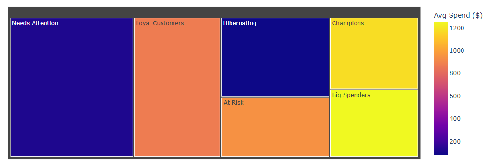
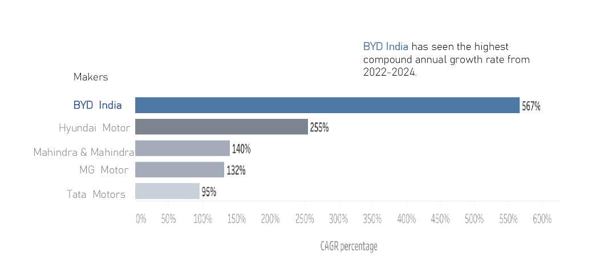
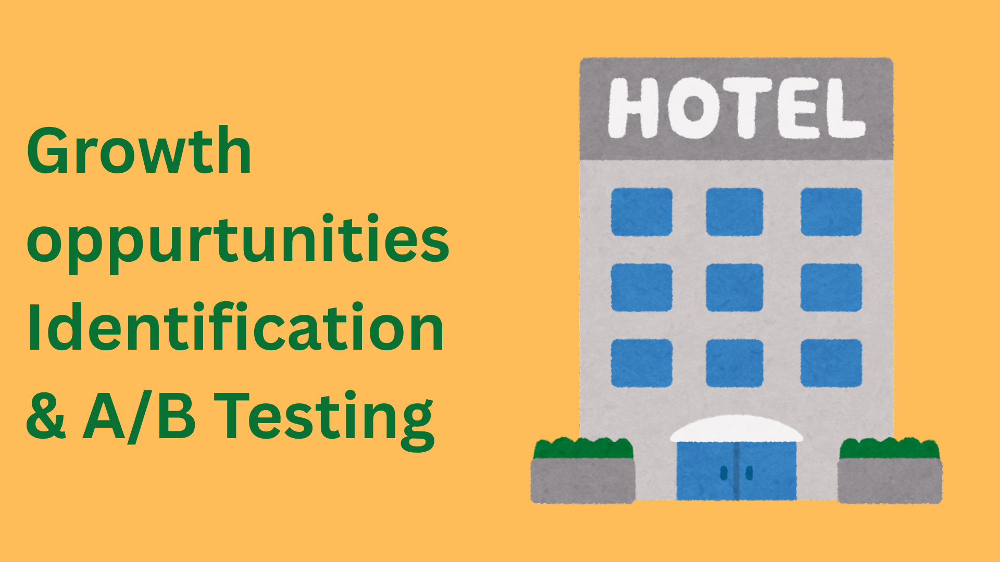

# Portfolio
## This portfolio is a compilation of some of the major data analytics projects I have done during my learning journey.
---
## Projects:

### Project 1: Wearable Device Usage Analysis: Uncovering Health & Activity Patterns

**Overview:** Analyzed Fitbit smart device data to uncover trends in user activity, sleep, and sedentary behavior, and translated findings into actionable product and marketing recommendations for Bellabeat — a health-tech company creating smart wellness products for women.

**Goal:** Identify trends in smart device usage, apply them to Bellabeat's customer base, and shape a data-driven marketing strategy for the Bellabeat Time wellness watch.

**Skills:** EDA, SQL (DDL, DML, CTEs, Window Functions, CASE Statements, Joins), Dashboard Design (LOD Expressions, Calculated Fields, Parameters, Layout Containers, Dynamic Filters, Light/Dark Mode), Data Storytelling

**Tools Used:** MS SQL Server, Tableau, Visual Studio Code, GitHub Copilot

**Results:**
1. Users average **7,500 steps/day** — 25% below WHO's 10,000 step recommendation — with **81% of daily time spent sedentary** (16.4 hrs).
2. Average sleep is **6.3 hrs/night**, creating a 10.5 hr weekly sleep deficit; users lose 42 mins nightly lying awake in bed.
3. Identified **54% of users as lightly active** — the prime Bellabeat target segment — with peak activity occurring in the evening (5–7 PM).
4. Recommended 3 Bellabeat product features: 60-min inactivity alert, bedtime wind-down notification, and weekday habit-building challenges.
5. Proposed marketing strategy: lead with the sleep gap story and schedule campaigns at 5–7 PM to align with peak user motivation.

---
### Project 2: Customer Segmentation Analysis

**Overview:** Analysed a 2,240-customer retail CRM dataset to identify why uniform marketing campaigns were generating low conversions. Used the RFM (Recency, Frequency, Monetary) framework to segment customers by actual purchasing behaviour and mapped 5 named campaigns to the segments that converted best.

**Goal:** To give the marketing team a data-backed answer to: **"Who are our customers really, and what's the smartest way to reach each group?"**

**Skills:** Data cleaning & outlier detection, feature engineering, RFM segmentation, ANOVA statistical validation, campaign conversion rate analysis, Data Visualization.

**Tools Used:** Python (libraries used — Pandas, NumPy, Matplotlib, Seaborn, Plotly, Scikit-learn, SciPy)

**Results:**
1. Identified 6 distinct customer segments with statistically validated spend differences (ANOVA p < 0.05).
2. Found Campaign 2 (New Arrivals Push) underperforming at <1.5% conversion — recommended pausing and reallocating budget.
3. Delivered 6 prioritised actions with estimated revenue impact of **~$170K–$255K**.

---
### Project 3: Electric Vehicle (EV) Market Analysis

**Overview:** A market intelligence study of India's EV landscape (FY 2022–2024) built for AtliQ Motors — a U.S.-based EV company with 25% North American market share but less than 2% in India. The analysis covers competitor mapping, state-level penetration rates, revenue growth, charging infrastructure gaps, and 2030 sales projections to inform their India entry strategy.

**Goal:**
1. Identify the top competitors in the 2-Wheeler and 4-Wheeler EV segments.
2. Determine the best states and month to launch — and which to avoid entirely.
3. Deliver three prioritised, data-backed recommendations for AtliQ Motors' India expansion.

**Skills:** Data collection from government sources, SQL (DDL, DML, CTEs, aggregations), CAGR & penetration rate analysis, geographic segmentation, revenue modelling, Data Visualization, PowerPoint storytelling (Situation–Complication–Resolution framework).

**Tools Used:** MS SQL Server, Tableau, PowerPoint.

**Results:**
1. *Competitor Landscape:* OLA Electric and TVS dominate 2-Wheelers; Tata Motors sells ~3× more than the next 4 competitors combined in 4-Wheelers.
2. *Launch Strategy:* Recommended Goa (24% penetration) for 2-Wheelers and Karnataka for 4-Wheelers — backed by 15% capital subsidy, SGST refunds, and interest-free loans for manufacturers. Optimal launch month: **March** (peak sales at 292K units).
3. *Market Opportunity:* Maharashtra, Kerala, Gujarat, and Karnataka projected to reach **8–13 million EV sales by 2030** — highest growth corridor in India.

[-green?logo=Excel)](https://github.com/Monika-Jhajhra/EV-Market-Analysis-Project/blob/main/Electric%20Vehicle%20Market%20Analysis.pdf)

---
### Project 4: Book Recommendation System

**Overview:** This project is a Content-based Book Recommendation System that suggests books similar to the one provided by the users. It analyzes various features of the input book and finds the most relevant matches using text-based similarity techniques.

**Goal:** To built a content-based filtering system that recommends books similar to a given book title using metadata such as the books title, author, description, etc.

**Skills:** Data cleaning & preprocessing, Text Vectorization, Similarity measurement, Text Processing with NLTK, Feature Engineering, EDA

**Tools Used:** Python ( Pandas – for data manipulation, Seaborn & Matplotlib – for data visualization ,scikit-learn – for cosine similarity, MinMaxScaler, and TfidfVectorizer,
NLTK – for text preprocessing (stopwords, lemmatization))

**Result:** 
1. Sucessfully recommends top 10 books similar to a given title.
2. Tested with several book titles- results were relevant, meaningful, and aligned well with input themes.
3. Effecient performance even on a large dataset with thousands of books.

---
### Project 5: Coffee Beans Sales Dashboard

**Overview:** This project features a Dynamic Sales Dashboard built in Microsoft Excel to analyze and visualize sales performance data for a Coffee Beans business. It provides valuable insights into total sales and profit by country-wise and time-based to support data-driven decisions.

**Goal:** To design an interactive excel dashboard that allows stakeholders to monitor key sales metrics, identify top performing products/ cities and track sales trends over time.

**Skills:** Data aggregation, Dashboard design, metric building, data analysis.

**Tools Used:** Microsoft Excel (Pivot Tables & Pivot Charts, Slicers for interactivity, etc.)

**Result:** 
1. Identified Profit by Coffee Type and Profit % by packet size.
2. Identified top 3 best performing cities.

---
### Project 6: Growth Opportunities Identification & A/B Testing: Uncovering Conversion Gaps & Validating Content Quality

**Overview:** Analyzed an online travel platform's hotel inventory and booking data to identify high-traffic, low-conversion hotels, quantify revenue loss, and validate content quality improvements through statistically rigorous A/B testing — translating SQL-driven opportunity analysis into actionable, experiment-backed business decisions.

**Goal:** Identify underperforming hotels using benchmark analysis, estimate revenue opportunity gaps, and determine whether improving hotel content quality leads to a statistically significant increase in conversion rate.

**Skills:** SQL (CTEs, JOINs, Window Functions, KPI Analysis, Benchmark Comparison, Revenue Opportunity Analysis), A/B Testing & Hypothesis Testing (Two-Proportion Z-Test, Confidence Intervals, Guardrail Metrics), EDA, Statistical Analysis, Business Problem Solving

**Tools Used:** MS SQL Server, Python (Pandas, NumPy, SciPy, Statsmodels), Jupyter Notebook, GitHub

**Results:**
1. Identified hotels with **high impressions but low CVR** — flagged as immediate revenue recovery opportunities using benchmark comparison in SQL.
2. Estimated **revenue gap** across underperforming hotels by comparing actual vs. benchmark conversion rates on trailing 90-day data.
3. Poor **content quality and pricing competitiveness** were the primary drivers of booking underperformance; inventory gaps further reduced revenue potential.
4. A/B test confirmed that improving hotel content quality produced a **statistically significant conversion uplift** (two-proportion z-test, p < 0.05).
5. Guardrail metric checks and pre-experiment balance validation ensured experiment integrity before drawing conclusions.

